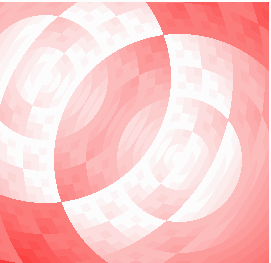



## Circle Swirl

### Description

LOOK AT THE SCREENSHOT. This shows a neat pattern of two faded circles mixing together. You can choose any color of which you want, does not have to be red.
 
### More Info
 

             |
---                |---
**Submitted On**   |2002-06-14 17:06:22
**By**             |[chrisM\_808](https://github.com/Planet-Source-Code/PSCIndex/blob/master/ByAuthor/chrism-808.md)
**Level**          |Intermediate
**User Rating**    |5.0 (15 globes from 3 users)
**Compatibility**  |VB 5\.0, VB 6\.0
**Category**       |[Graphics](https://github.com/Planet-Source-Code/PSCIndex/blob/master/ByCategory/graphics__1-46.md)
**World**          |[Visual Basic](https://github.com/Planet-Source-Code/PSCIndex/blob/master/ByWorld/visual-basic.md)
**Archive File**   |[Circle\_Swi945856142002\.zip](https://github.com/Planet-Source-Code/chrism-808-circle-swirl__1-35855/archive/master.zip)

